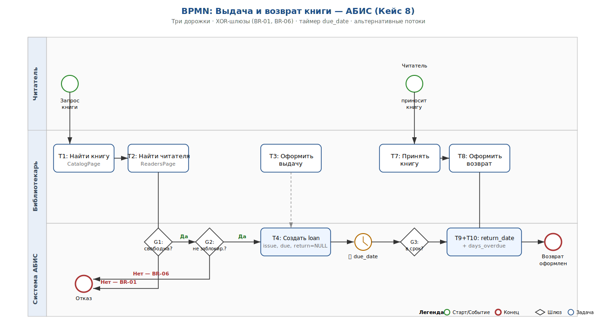
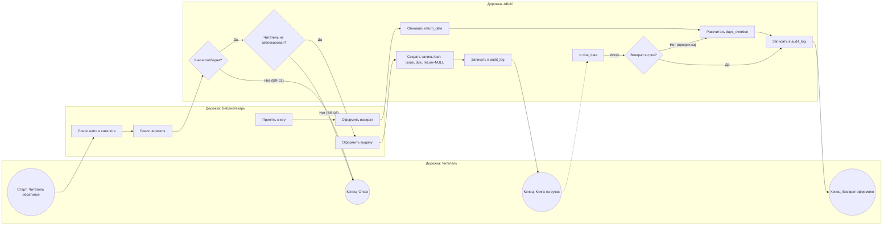

# Бизнес-процесс «Выдача–Возврат» и UI-flow — АБИС (Кейс 8)

| Версия | Статус | Дата       |
|--------|--------|------------|
| v3.0   | Final  | 2026-04-25 |

## 1. Назначение

Документ содержит финальную BPMN-схему основного бизнес-процесса «выдача–возврат книги», её расширения (исключения, таймеры) и связанный с ней UI-flow экранов фронтенда.

## 2. Нотация

Используется упрощённая **BPMN 2.0**:
- ⚪ `Start` — стартовое событие;
- ⭕ `End` — завершающее событие;
- ▭ `Task` — пользовательская или сервисная задача;
- ◇ `Gateway` — шлюз (exclusive XOR);
- ⏲ `Timer` — таймерное событие;
- `Lane` — дорожка ответственности.

## 3. BPMN v2 — основной процесс (happy path + расширения)

### 3.1 Графическая схема

Файл: [`image/BPMN-loan-return-v2.svg`](image/BPMN-loan-return-v2.svg) — полная BPMN-диаграмма с тремя дорожками (Читатель, Библиотекарь, Система АБИС), шлюзами (G1: BR-01, G2: BR-06, G3: контроль срока), таймером `due_date` и двумя завершающими событиями (отказ и успешный возврат).



### 3.2 Та же схема в Mermaid (для инлайн-чтения в Git)



## 4. Расширения процесса

| Расширение             | Триггер                                   | Реакция                                                              |
|------------------------|-------------------------------------------|----------------------------------------------------------------------|
| **Исключение BR-01**   | Книга уже выдана                          | Сообщение пользователю, запись в лог, возврат в начало               |
| **Исключение BR-06**   | Читатель заблокирован                     | Отказ в выдаче, уведомление администратору                           |
| **Таймер due_date**    | Наступление `due_date` без возврата       | Попадание в отчёт «Просрочки», `days_overdue` начинает расти ежедневно|
| **Списание (Could)**   | Повреждённая/утерянная книга при возврате | Поле `состояние_книги` = «Повреждена»/«Утеряна», запись в аудит      |
| **Продление (Could)**  | Запрос продления до `due_date`            | Не реализовано в MVP, отмечено в backlog                             |

## 5. Описание шагов процесса (текстовое)

1. **Читатель обратился** за книгой (лично или через каталог).
2. Библиотекарь ищет книгу (`T1`) и карточку читателя (`T2`).
3. Система проверяет доступность экземпляра (`G1`, правило BR-01).
4. Система проверяет, не заблокирован ли читатель (`G2`, правило BR-06).
5. Библиотекарь оформляет выдачу (`T3`).
6. Система создаёт запись `loans` с `issue_date`, `due_date` (по умолчанию +14 дней), `return_date = NULL` (`T4`).
7. Система пишет событие в `audit_log` (`T5`).
8. Книга на руках у читателя (`End2`). Идёт отсчёт срока (`Timer due_date`).
9. Читатель возвращает книгу (`T7`).
10. Библиотекарь оформляет возврат (`T8`).
11. Система обновляет `return_date`, вычисляет `days_overdue = max(0, return_date - due_date)` (`T9`, `T10`).
12. Запись в `audit_log` (`T11`). Процесс завершён (`End3`).

## 6. Связь BPMN-шагов с User Stories

| Шаг BPMN | User Story      | Эндпоинт API              | Экран UI        |
|----------|-----------------|---------------------------|-----------------|
| T1       | US-01, US-02    | `GET /books`              | CatalogPage     |
| T2       | US-04           | `GET /readers/{id}`       | ReadersPage     |
| T3, T4   | US-05           | `POST /loans`             | LoansPage       |
| T7, T8   | US-06           | `POST /loans/{id}/return` | LoansPage       |
| T10      | US-08           | `GET /reports/overdue`    | OverduePage     |

## 7. UI-flow (логическая карта экранов)

```
Login ──► Home ──┬── Catalog ── Карточка книги
                 ├── Readers ── Карточка читателя
                 ├── Loans ──── Новая выдача / Возврат
                 ├── Overdue ── Экспорт CSV
                 ├── Profile ── История / Уведомления
                 ├── Integration ── Импорт/Экспорт CSV
                 └── Settings ─── Пользователи, роли
```

Полное описание связей экранов — в файле `DOC-ARC-003-ui-flow-and-wireframes.md`.

## 8. Проверочный чек-лист BPMN

- [x] Все 5 пользовательских операций MVP отражены.
- [x] Учтены оба сценария: happy path и с просрочкой.
- [x] Добавлены два шлюза (BR-01, BR-06) с явными альтернативными потоками.
- [x] Присутствует таймерное событие `due_date`.
- [x] Все критерии приёмки Кейса 8 имеют соответствующий шаг процесса.
